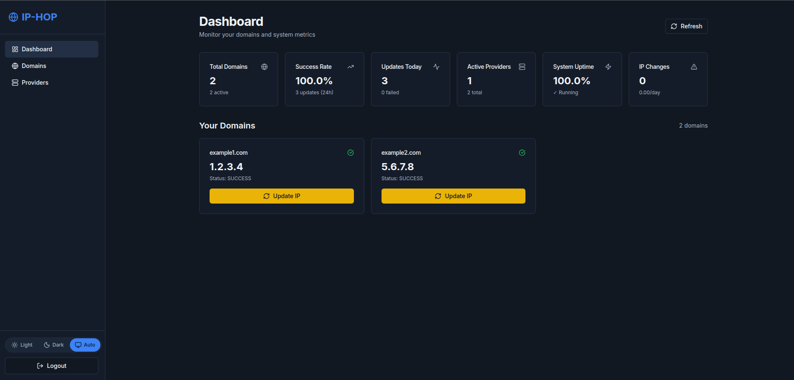
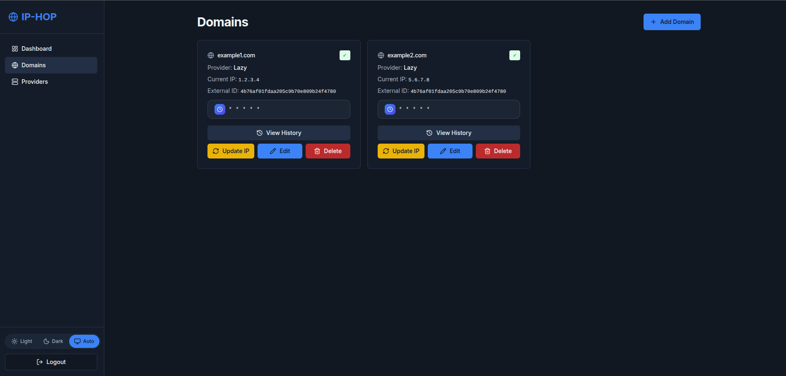
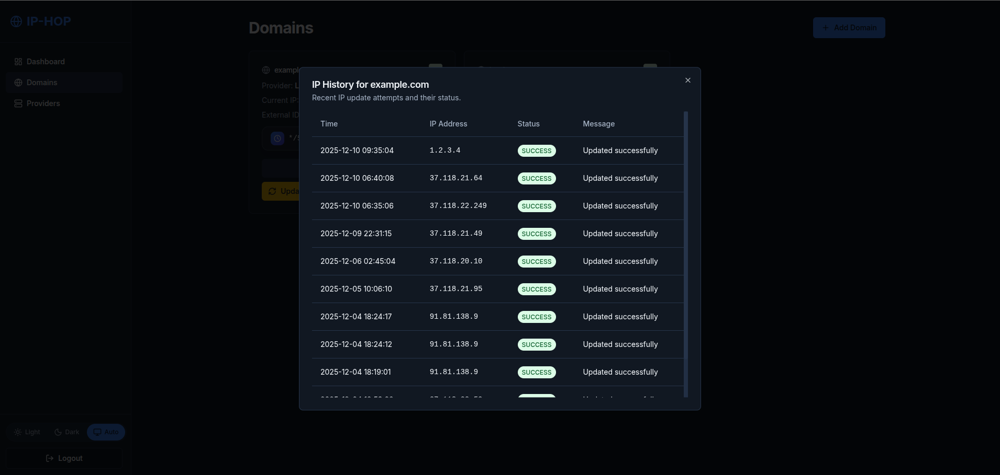
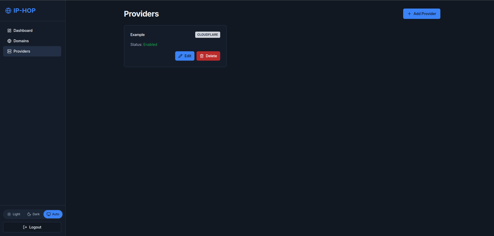

# IP-HOP Documentation

Welcome to the **IP-HOP** documentation! 🚀

IP-HOP is a powerful Dynamic DNS management application designed for home lab environments, with first-class support for Raspberry Pi and ARM64 devices.

## Overview

IP-HOP provides a modern, user-friendly interface for managing your dynamic DNS services. Whether you're running home servers, self-hosting applications, or managing a home lab, IP-HOP makes it easy to keep your domains updated with your current IP address.

### Key Features

- 🌐 **Multi-Provider Support**: Compatible with major DDNS providers
- 🔒 **Secure**: Built with security best practices and encrypted storage
- 🐳 **Docker-First**: Easy deployment with Docker and Docker Compose
- 🍓 **Raspberry Pi Ready**: Optimized for ARM64 devices
- 🎨 **Modern UI**: Beautiful, responsive interface built with Next.js
- 📊 **Monitoring**: Real-time status updates and history tracking
- 🔄 **Auto-Updates**: Intelligent IP change detection
- 🌙 **Dark Mode**: Full theme customization

### Architecture

IP-HOP consists of two main components:

- **Backend**: FastAPI-based REST API (Python 3.12)
- **Frontend**: Next.js 15 application with modern React

Both components run in a single Docker container for easy deployment.

## Quick Links

-   :material-rocket-launch:{ .lg .middle } __Getting Started__

    ---

    New to IP-HOP? Start here for a quick introduction and setup guide.

    [:octicons-arrow-right-24: Get Started](getting-started.md)

-   :material-docker:{ .lg .middle } __Installation__

    ---

    Deploy IP-HOP with Docker, Docker Compose, or on Raspberry Pi.

    [:octicons-arrow-right-24: Install](installation/docker-compose.md)

-   :material-cog:{ .lg .middle } __Configuration__

    ---

    Configure providers, environment variables, and network settings.

    [:octicons-arrow-right-24: Configure](configuration/environment.md)

-   :material-api:{ .lg .middle } __API Reference__

    ---

    Explore the REST API endpoints and authentication.

    [:octicons-arrow-right-24: API Docs](api/overview.md)

## Community & Support

IP-HOP is an open-source project built for the home lab community. We welcome contributions, feedback, and questions!

- 💬 **Discussions**: Share ideas and ask questions
- 🐛 **Issues**: Report bugs or request features
- 🤝 **Contributing**: Help improve IP-HOP

[:fontawesome-brands-github: View on GitHub](https://github.com/Taoshan98/ip-hop){.md-button}

## Screenshots

!!! example "Dashboard"
    Beautiful, intuitive dashboard for managing your DDNS domains.
    

!!! example "Domains List"
    List of all your DDNS domains.
    

!!! example "History"
    History of all IP changes for the domain.
    

!!! example "Provider Management"
    Easy configuration of multiple DDNS providers.
    

---

Ready to get started? Head over to the [Getting Started](getting-started.md) guide!
